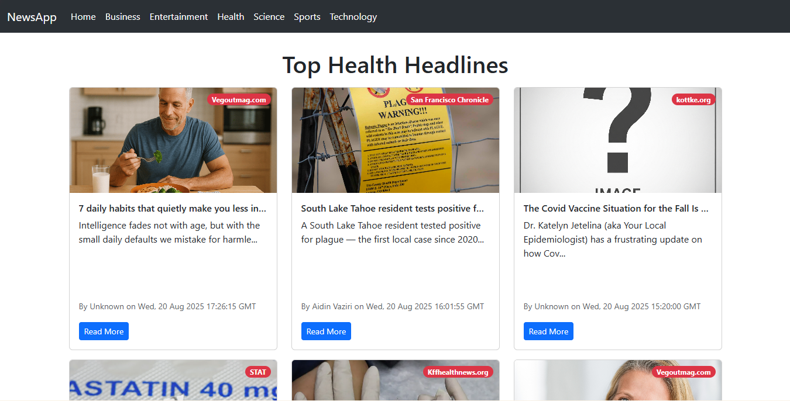

# 📰 NewsApp

A simple news application built with **React** that fetches the latest news from [NewsAPI](https://newsapi.org/) and displays them in a clean, responsive UI.  
Inspired by apps like *Inshorts*, it provides short descriptions of news articles with links to the full story.

---

## 🚀 Features
- Browse the latest news across multiple categories (e.g., Business, Sports, Technology, Health, etc.)
- Short and clean card-style news display
- Read full articles by clicking the “Read More” button
- Responsive layout using **Bootstrap**
- Smooth navigation using **React Router**

---

## 🛠️ Tech Stack
- **React.js**
- **React Router**
- **Bootstrap**
- **NewsAPI**

---


## 📸 Screenshot




## 📦 Installation & Setup

1. Clone the repository:
   ```bash
   git clone https://github.com/your-username/newsapp.git
   cd newsapp
   ```
2. Install dependencies:
  ```bash
   npm install
  ```
3. Create a .env file in the project root and add your NewsAPI
 key:
```bash
REACT_APP_NEWS_API_KEY=your_api_key_here
```
4. Run the development server:
```bash
npm start
```
5. Open your browser at:
```bash
http://localhost:3000
```
### 📚 What I Learned

- Through building this project, I learned:
- How to integrate third-party APIs (NewsAPI) into a React app.
- Using React Router for smooth navigation across pages.
- Structuring React components for better reusability.
- Applying Bootstrap for responsive and mobile-friendly design.
- Managing environment variables securely with a .env file.
